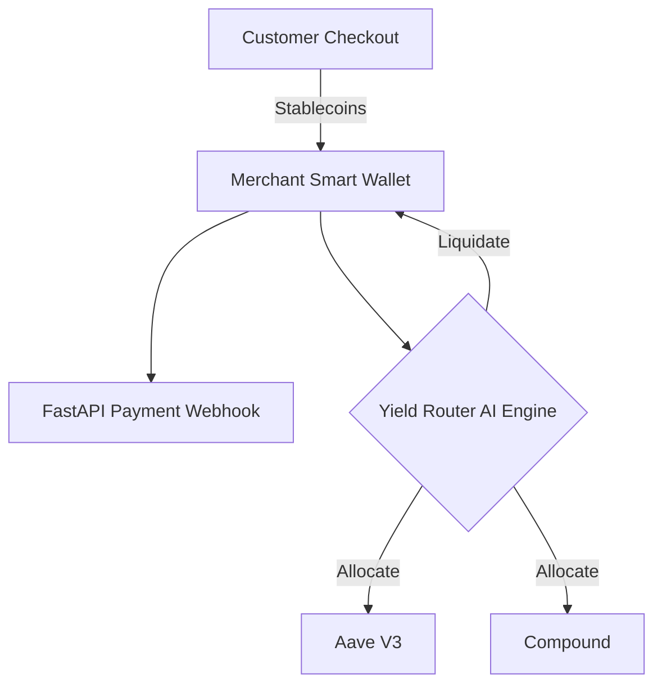

# DeFi Payment Processor & Yield Optimizer


## 📖 Overview
The **DeFi Payment Processor & Yield Optimizer** is a crypto-native stablecoin application acting as a seamless Web3 payment gateway. Unlike traditional gateways, it automatically routes idle merchant funds to optimal, risk-adjusted DeFi yield-farming strategies while maintaining liquidity.

## ✨ Key Features
- **Crypto Payment Gateway:** Accept USDC, USDT, and DAI seamlessly with webhooks for merchant order fulfillment.
- **Auto-Routing Yield:** Uses deep reinforcement learning/heuristics to shift idle treasury funds across Aave, Compound, and Maker protocols for maximum APY.
- **Non-Custodial Architecture:** Smart-contract driven logic ensuring the merchant retains custody of their keys and assets.
- **Gas Optimization:** Batches transactions and monitors network gas prices to execute yield rebalancing cost-effectively.

## 🏗 System Architecture


## 📂 Repository Structure
- `ai_engine/`: Yield prediction models and gas optimization algorithms.
- `backend/`: Webhook receivers and blockchain indexer integration.
- `infra/`: Docker implementations.

## 🚀 Getting Started

### Local Development
1. Clone the repository and install dependencies:
   ```bash
   pip install -r requirements.txt
   ```
2. Export your RPC URLs (e.g., Alchemy/Infura) to your environment variables.
3. Start the API:
   ```bash
   uvicorn backend.main:app --host 0.0.0.0 --port 8000
   ```

## 🛠 Known Issues
- Smart contract auditing required prior to mainnet deployment.

## 🤝 Contributing
Open to PRs optimizing yield heuristics and integrating additional EVM-compatible chains.
